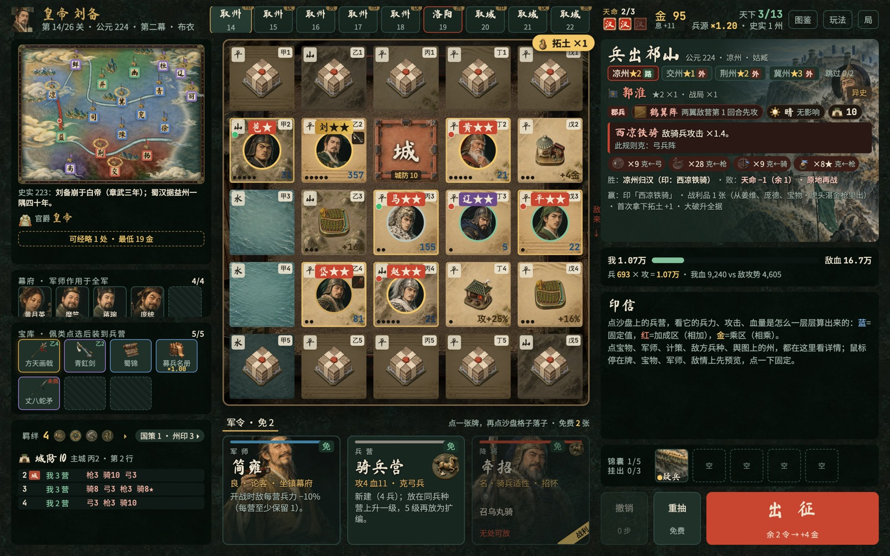
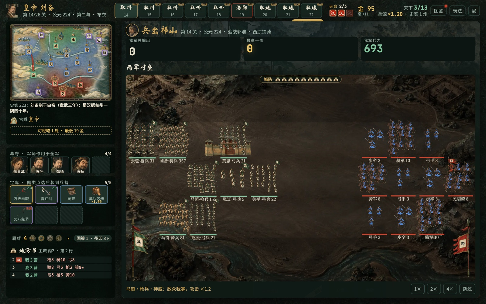
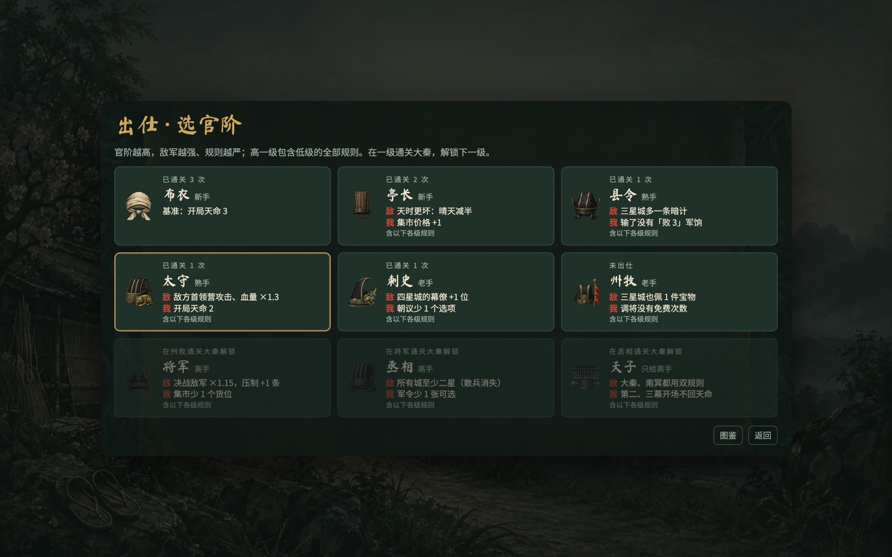
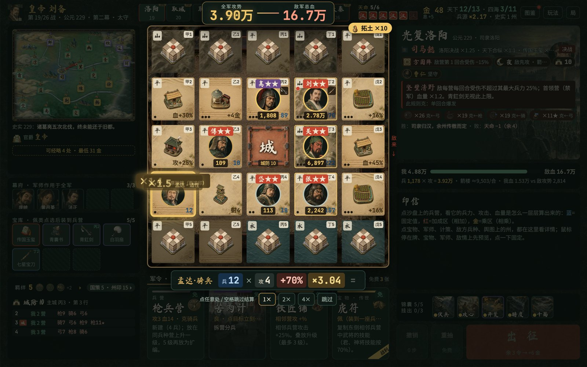
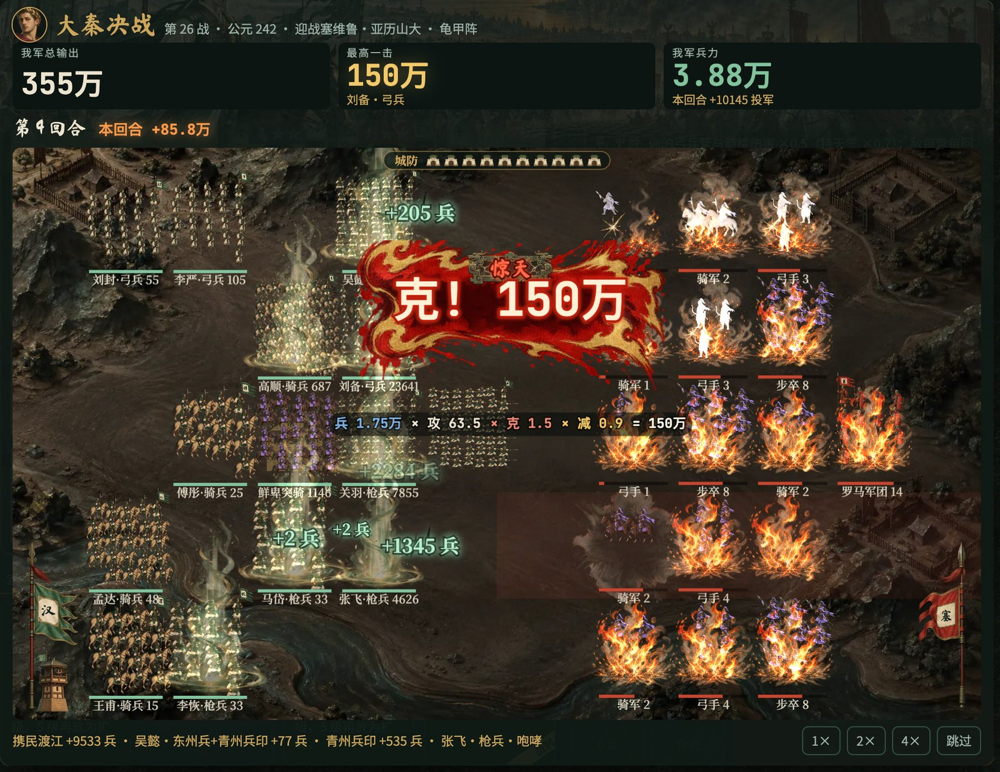
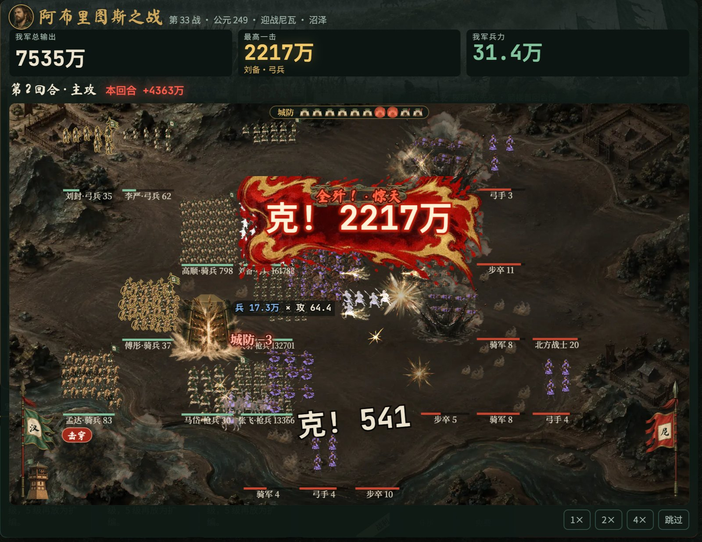

# Qunxiong · 试玩版（Mac / Windows）

Qunxiong 是开发代号，正式名还没定。

一款三国题材的肉鸽策略游戏。在沙盘格子上摆兵营、武将和军师，战斗自动进行，加成与倍率层层叠加。刘备从白身起家：

- 第一幕沿他一生的 12 场战役打。史实里的五场败仗也得打赢才能往前走，赢了就改写历史。
- 第二幕在舆图上逐州攻取、光复洛阳，第三幕远征四海、决战大秦。每座城都标了星级，星级越高越强，奖励也越多。
- 第四幕「万国」一路打到欧罗巴、非洲和新大陆，之后是无尽的「万世」。

主城可以驻军、升级城墙。野战军打光了不算输，城破才算输。赢了才前进；输了扣 1 点天命，原地再战这一关。天命最多 3 点，用完这一局就结束。官阶从布衣起步，在一级通关大秦才解锁下一级，越往上越难：敌兵更多、更强，第二幕起敌军还会看你的布阵挑阵法、排兵。

这是开发中的试玩版，数值和界面还会改。

## 截图

备战：在沙盘格子上摆兵营、放武将、佩宝物、挂计策。右边是这一关要打的城：可选的城与星级、默认路线（「路」）、敌军档位、阵法与天时，还有赢了能拿到什么。



开战：战斗自动进行，敌军从右边来。阵中的城楼是主城；哪一行没有我军挡着，那一行的敌军就去攻城，城防归零即城破。



选官阶：官阶越高，敌军越强、规则越严，每升一级敌我两边各多一条规则。在一级通关大秦，解锁下一级。



点兵结算：出征时逐营亮出算式（兵力 × 攻击 × 加成 × 倍率），汇成全军攻势，与敌军总血对撞。



大秦决战：刘备的弓兵一击 150 万。



第四幕「万国」：阿布里图斯之战，一击 2217 万。



前三张截图来自 v0.10.1，后三张来自 v0.9.2。

## 下载

最新版是 **v0.11.1**（2026-09-30）：

| 系统 | 下载 |
|---|---|
| Mac（Apple 芯片） | [Qunxiong-0.11.1-arm64.dmg](https://github.com/gangchen/qunxiong-releases/releases/download/v0.11.1/Qunxiong-0.11.1-arm64.dmg) |
| Windows（64 位） | 安装版 [Qunxiong-0.11.1-x64-setup.exe](https://github.com/gangchen/qunxiong-releases/releases/download/v0.11.1/Qunxiong-0.11.1-x64-setup.exe)（推荐）；免安装版 [Qunxiong-0.11.1-x64.zip](https://github.com/gangchen/qunxiong-releases/releases/download/v0.11.1/Qunxiong-0.11.1-x64.zip) |

v0.11.1 改了规则，旧版本没打完的那一局不能接着打（见下面「说明」）。

历次版本都在 [Releases](https://github.com/gangchen/qunxiong-releases/releases)，每一版的发布说明里写了改动和 SHA-256 校验值。

## 系统要求

**Mac**
- Apple 芯片的 Mac（M1 及以后）。Intel 芯片的 Mac 暂不支持。
- macOS 13 或更新。
- 约 400 MB 磁盘空间。

**Windows**
- Windows 10 或 11，64 位。
- 约 450 MB 磁盘空间。

## 安装

### Mac

这个版本还没有经过 Apple 公证，第一次打开会被系统拦下，需要手动放行一次：

1. 打开下载的 dmg，把 Qunxiong 拖进「应用程序」文件夹。
2. 双击 Qunxiong，系统提示无法验证时，点「完成」。
3. 打开「系统设置 → 隐私与安全性」，拉到「安全性」一栏，点 Qunxiong 旁边的「仍要打开」。输入开机密码或用触控 ID 确认，再在弹窗里点「打开」。macOS 15 起，「右键 → 打开」已经不能绕过这一步。
4. 如果提示「已损坏，无法打开」，打开「终端」运行下面这行，再双击 Qunxiong：

```bash
xattr -dr com.apple.quarantine /Applications/Qunxiong.app
```

### Windows

这个版本还没有做代码签名，第一次运行时 Windows 会提示一次：

1. 双击下载的 `Qunxiong-<版本>-x64-setup.exe`。
2. 如果弹出「Windows 已保护你的电脑」，点「更多信息」，再点「仍要运行」。
3. 按安装向导装好。默认装在当前用户下，不需要管理员权限，也可以改安装位置。装好后从桌面或开始菜单里的 Qunxiong 打开。

不想安装的话，下载 zip，解压到任意文件夹，双击里面的 `Qunxiong.exe`。

## 版本记录

- **v0.11.1**（2026-09-30）：难度曲线整体重做，每个官阶逐关重新校准：同一官阶越往后越难，史实败仗和各幕决战只上一级小台阶，同一关官阶越高越难。史实败仗改成必打，第 12 关固定是夷陵。官阶规则换成「敌军用兵」：州牧起按你的阵挑阵法，将军起出征时按你的布阵重排前后，丞相起再重选主攻的一行，全在本机推演。敌军血量沿关只升不降，官阶越高敌兵越多。第四幕每章开场回 1 点天命。新增本机战绩记录。
- **v0.10.4**（2026-09-29）：主城驻军（枪兵营、弓兵营可放进主城格，敌营攻城先打驻军）；城墙四级与六项工事，修城令改为升一级城墙、工事三选一；只有城破才算输，打到一方打完为止（第 9 回合起粮尽）；刘备·携民渡江改为利滚利但涨得慢、范围更窄；第一战不再必败；官阶从第 2 关起拉开，敌方加项逐关上场；第一至第三幕按真人试玩重新校准；横屏军令手牌改成扑克牌式；新增 15 张美术。
- **v0.10.1**（2026-09-28）：推进规则重做：赢了才前进，输了扣 1 点天命、原地再战，天命最多 3 点。第二、三幕的城分星级、有默认路线；敌军分五档（散兵、郡兵、劲旅、名将、决战），名将城有敌方幕僚和宝物。官阶改为进阶式，从布衣起逐级解锁。宝物分随将与随营，备战时可以调将。战场主城换成城楼图，新增 34 张美术。适配 16:9 屏幕。难度按新规则整体重新校准。
- **v0.9.2**（2026-09-27）：本机排行榜（最远征程、一击封神、最强一战、累计输出、势如破竹，各留前 10 名）；新增 Windows 版（64 位）；安装包不再附带 Steam 组件。
- **v0.9.1**（2026-09-27）：加入音效与音乐；启动先到标题页；新增设置页（全屏、音量、切到别的窗口时静音、战斗回放速度、出征前的结算演出）和「关于」页。
- **v0.8.3**（2026-09-27）：行前排与击穿攻城、开局选主城、每战随机的天时 / 阵法 / 副将 / 敌计、第四幕「万国」、备战界面重做、新增 119 张美术。

## 说明

- 游戏完全离线，不联网，也不收集任何数据。v0.11.1 起每打一仗会在存档目录下的 `playlog.jsonl` 记一行战绩（版本、官阶、第几关、胜负、天命前后），只存在你电脑上，不上传。
- 有音效和配乐。「设置」里可以分别调总音量、音乐和音效；切到别的窗口时默认静音，也可以关掉。
- 存档只保存在你自己的电脑上：Mac 在 `~/Library/Application Support/Qunxiong`，Windows 在 `%APPDATA%\Qunxiong`。
- 更新时下载新版，替换旧版即可：Mac 把新版拖进「应用程序」覆盖旧版；Windows 直接运行新版安装程序（免安装版换掉整个文件夹）。官阶、排行榜和图鉴会保留。
- v0.11.1 改了规则，旧版本没打完的那一局不能接着打：启动时会把它另存进存档目录下的 `quarantine` 文件夹，然后从头开始。用 v0.11.1 存过档以后，不要再退回旧版：旧版读不懂新存档，会把它另存起来、从头开始。
- 下载的文件可以用每个版本发布说明里的 SHA-256 核对：Mac 在「终端」里运行 `shasum -a 256 <文件名>`，Windows 在 PowerShell 里运行 `Get-FileHash <文件名>`。

## 反馈

问题和建议请提到本仓库的 [Issues](https://github.com/gangchen/qunxiong-releases/issues)（需要 GitHub 账号）。

## 许可

本仓库只用来分发试玩安装包，不含源代码。安装包请勿修改或转售。

游戏内的字体 Noto Sans SC、Noto Serif SC、Ma Shan Zheng 和 JetBrains Mono 按 SIL Open Font License 1.1 授权，随包附有许可全文。游戏里的音效和音乐由程序合成，不含第三方音频素材。
